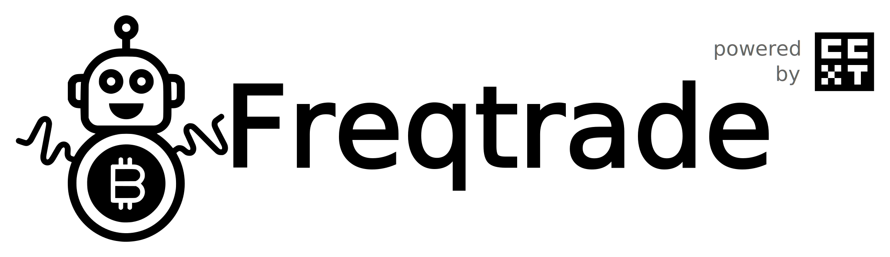

## 介绍

Freqtrade 是一个用 Python 编写的开源数字货币交易机器人，支持主流交易所，可通过 Telegram 或内置 WebUI 管理。内置回测、绘图、资金管理与策略优化工具。

!!! 警告 "免责声明"
    本软件仅用于学习研究。请勿投入无法承受亏损的资金。使用风险自负，作者及相关方不对任何交易结果负责。

> 个人/本地使用
> 若仅在个人受信任设备上使用，请将服务绑定到 `127.0.0.1`，避免对公网暴露。迁移到远程/多用户环境时，请启用鉴权（JWT/Basic）、配置 CORS 白名单，并考虑启用 Redis 限流。

## 功能

- 用 Python 3.11+ 开发与运行
- 策略开发与回测、超参优化（Hyperopt）
- FreqAI 智能策略（自适应训练）
- WebUI 与 Telegram 控制
- 历史数据下载与分析

