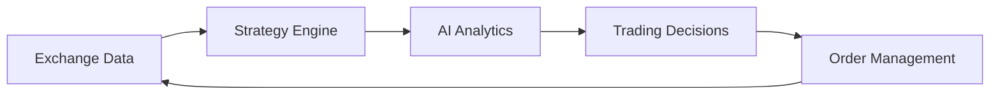

# Cryptocurrency Trading Platform - Parallel Development Roadmap

## Executive Summary

This roadmap outlines a comprehensive parallel development strategy for three core modules of the cryptocurrency quantitative trading platform, leveraging the existing Rust-based event-driven architecture to achieve millisecond latency requirements.

### Current Architecture Assessment
- ✅ **Event-Driven Foundation**: NATS JetStream for event streaming
- ✅ **WebSocket Infrastructure**: Sharded WebSocket system supporting 10k+ concurrent connections
- ✅ **Performance Core**: Rust backend with optimized memory management
- ✅ **Trading Models**: Comprehensive order, position, and trade data structures
- ✅ **Algorithmic Framework**: TWAP, VWAP, POV, and Iceberg algorithms implemented
- ⚠️ **Exchange Integration**: Basic connector structure exists, needs full implementation
- ⚠️ **Strategy Engine**: Template system exists, needs visual builder and backtesting
- ❌ **AI Analytics**: Not implemented, requires new service development

## Module Overview & Development Strategy

### Module 1: Exchange Data Layer (EX-DL)
**Purpose**: Real-time market data integration with Binance/OKX
**Complexity**: Medium | **Priority**: Critical | **Timeline**: 8 weeks

### Module 2: Strategy Engine (ST-EN)
**Purpose**: Visual strategy builder with backtesting capabilities
**Complexity**: High | **Priority**: High | **Timeline**: 12 weeks

### Module 3: AI Analytics Service (AI-AS)
**Purpose**: DeepSeek/Gemini integration for market analysis
**Complexity**: Medium | **Priority**: Medium | **Timeline**: 10 weeks

---

## Phase 1: Foundation & Architecture (Weeks 1-3)

### 🎯 Parallel Preparation Phase

#### EX-DL Team (2 developers)
**Week 1-2: Market Data Infrastructure**
- [ ] Design real-time data pipeline architecture
- [ ] Implement WebSocket connection managers for Binance/OKX
- [ ] Create data normalization layer for cross-exchange compatibility
- [ ] Set up Redis clusters for market data caching (sub-millisecond access)

**Week 3: Integration Framework**
- [ ] Implement exchange connector base traits
- [ ] Create market data event types in existing event system
- [ ] Design failover and reconnection strategies

#### ST-EN Team (3 developers)
**Week 1-2: Strategy Framework Extension**
- [ ] Extend existing strategy template system
- [ ] Design visual component JSON schema
- [ ] Create strategy execution state machine
- [ ] Implement drag-drop component registry

**Week 3: Backtesting Architecture**
- [ ] Design historical data provider interface
- [ ] Implement event-driven backtest engine
- [ ] Create performance metrics calculation framework

#### AI-AS Team (2 developers)
**Week 1-2: AI Service Foundation**
- [ ] Design microservice architecture for AI analytics
- [ ] Implement DeepSeek API integration
- [ ] Create Gemini API wrapper with rate limiting
- [ ] Set up model response caching system

**Week 3: Analytics Pipeline**
- [ ] Design market analysis event types
- [ ] Implement analysis result storage (PostgreSQL + Redis)
- [ ] Create AI model response validation framework

### 🔗 Integration Points Established
- **Event Bus Extensions**: New event types for market data, strategy signals, AI insights
- **Shared Data Models**: Cross-module data structure definitions
- **Authentication System**: Unified API key management for exchanges and AI services

---

## Phase 2: Core Implementation (Weeks 4-8)

### EX-DL Development Focus

#### Week 4-5: Binance Integration
```rust
// Key deliverables
- Real-time WebSocket streams (trades, orderbook, tickers)
- REST API wrapper with rate limiting
- Market data normalization pipeline
- Event publishing to NATS JetStream
```

**Performance Targets**:
- Market data latency: <5ms from exchange to internal event
- Throughput: 100k+ market data events/second
- Uptime: 99.9% connection stability

#### Week 6-7: OKX Integration
- Implement OKX-specific WebSocket and REST integrations
- Cross-exchange arbitrage opportunity detection
- Unified market data format across exchanges

#### Week 8: Optimization & Monitoring
- Connection pooling and load balancing
- Comprehensive metrics and alerting
- Performance benchmarking and tuning

### ST-EN Development Focus

#### Week 4-5: Visual Strategy Builder
```javascript
// Frontend components (HTML5 + TypeScript)
- Drag-drop strategy canvas
- Pre-built indicator and signal components
- Real-time strategy preview
- Parameter configuration panels
```

#### Week 6-7: Backtesting Engine
```rust
// Rust core engine
- Historical data replay system
- Multi-strategy parallel backtesting
- Performance analytics (Sharpe ratio, max drawdown, etc.)
- Risk management simulation
```

#### Week 8: Strategy Execution
- Live strategy deployment system
- Position management integration
- Risk controls and circuit breakers

### AI-AS Development Focus

#### Week 4-5: Market Analysis Pipeline
```rust
// Core analysis features
- Technical indicator analysis
- Market sentiment processing
- Pattern recognition algorithms
- Multi-timeframe analysis
```

#### Week 6-7: AI Model Integration
- DeepSeek model fine-tuning for crypto markets
- Gemini integration for natural language insights
- Ensemble model predictions
- Confidence scoring system

#### Week 8: Real-time Analytics
- Live market analysis streaming
- Alert generation system
- Performance tracking and model drift detection

---

## Phase 3: Integration & Optimization (Weeks 9-12)

### 🔄 Cross-Module Integration

#### Week 9: Data Flow Integration


**Integration Tasks**:
- Market data → Strategy signal generation
- AI insights → Strategy parameter optimization
- Strategy signals → Order generation via sandbox engine

#### Week 10: End-to-End Testing
- Integration test suites for all module combinations
- Load testing with 50k+ concurrent WebSocket connections
- Latency optimization (target: sub-millisecond internal processing)
- Memory leak detection and optimization

#### Week 11: User Interface Integration
- Strategy builder frontend integration
- Real-time dashboard with market data visualization
- Dark/light theme implementation
- Mobile responsiveness optimization

#### Week 12: Performance Tuning & Documentation
- Final performance optimization
- API documentation completion
- User guides and educational content
- Deployment automation scripts

---

## Resource Allocation & Team Structure

### Development Teams

#### Team A: Exchange Data Layer (2 developers)
- **Lead**: Senior Rust developer with exchange API experience
- **Developer**: WebSocket and high-frequency data specialist
- **Focus**: Market data ingestion, normalization, and distribution

#### Team B: Strategy Engine (3 developers)
- **Lead**: Full-stack developer with quantitative finance background
- **Rust Developer**: Backtesting engine and performance optimization
- **Frontend Developer**: HTML5/TypeScript visual builder interface
- **Focus**: Strategy creation, backtesting, and execution

#### Team C: AI Analytics (2 developers)
- **Lead**: Machine learning engineer with NLP experience
- **Developer**: API integration and data pipeline specialist
- **Focus**: AI model integration and market analysis

#### Team D: Integration & QA (2 developers)
- **Integration Lead**: DevOps and system integration expert
- **QA Engineer**: Automated testing and performance validation
- **Focus**: Cross-module integration and quality assurance

### Timeline & Milestones

| Week | EX-DL | ST-EN | AI-AS | Integration |
|------|-------|-------|-------|-------------|
| 1-3 | Foundation | Architecture | Service Setup | Event Design |
| 4-6 | Binance/OKX | Visual Builder | AI Pipeline | Data Flow |
| 7-9 | Optimization | Backtesting | Real-time Analytics | Testing |
| 10-12 | Polish | Execution | Monitoring | Production |

---

## Inter-Module Dependencies & Integration Points

### 🔗 Critical Integration Interfaces

#### 1. Market Data Flow
```rust
// EX-DL → ST-EN
pub struct MarketDataEvent {
    pub exchange: String,
    pub symbol: String,
    pub data: MarketData,
    pub timestamp: DateTime<Utc>,
}

// ST-EN → AI-AS
pub struct StrategyAnalysisRequest {
    pub strategy_id: Uuid,
    pub market_context: MarketContext,
    pub performance_metrics: PerformanceMetrics,
}
```

#### 2. Event System Extensions
- **Market Events**: Price updates, orderbook changes, trade executions
- **Strategy Events**: Signal generation, position changes, performance updates
- **AI Events**: Analysis results, model predictions, alert notifications

#### 3. Shared Data Stores
- **Redis Cache**: Hot market data, strategy states, AI model results
- **PostgreSQL**: Historical data, strategy configurations, user preferences
- **Time-series DB**: Performance metrics, backtesting results, analytics

### Dependency Management
- **EX-DL → ST-EN**: Market data dependency (loose coupling via events)
- **ST-EN → AI-AS**: Strategy performance data (asynchronous analysis)
- **AI-AS → ST-EN**: Analysis insights (optional optimization input)
- **All → Frontend**: WebSocket data streams (real-time updates)

---

## Risk Mitigation Strategies

### 🚨 Technical Risks & Mitigations

#### 1. Latency Requirements (Critical Risk)
**Risk**: Inability to achieve millisecond latency targets
**Mitigation**:
- Pre-allocate memory pools for high-frequency operations
- Use lock-free data structures where possible
- Implement zero-copy message passing
- Continuous latency monitoring and alerting

#### 2. Exchange API Limits (High Risk)
**Risk**: Rate limiting and connection restrictions
**Mitigation**:
- Implement adaptive rate limiting with backoff strategies
- Use multiple API keys and connection pools
- Implement request queuing and prioritization
- Create fallback mechanisms for API failures

#### 3. Data Consistency (Medium Risk)
**Risk**: Cross-exchange data synchronization issues
**Mitigation**:
- Implement timestamp-based data ordering
- Use idempotent event processing
- Create data validation and reconciliation processes
- Implement event sourcing for audit trails

#### 4. AI Model Performance (Medium Risk)
**Risk**: AI models providing poor predictions
**Mitigation**:
- Implement model versioning and A/B testing
- Create confidence scoring for all predictions
- Use ensemble methods for improved accuracy
- Implement human-in-the-loop validation

### 🛠️ Development Risks & Mitigations

#### 1. Team Coordination (High Risk)
**Risk**: Integration issues between parallel development teams
**Mitigation**:
- Daily cross-team stand-ups
- Shared interface contracts defined early
- Continuous integration testing
- Dedicated integration team oversight

#### 2. Scope Creep (Medium Risk)
**Risk**: Feature expansion beyond MVP requirements
**Mitigation**:
- Strict MVP definition and documentation
- Regular stakeholder review meetings
- Feature freeze periods before milestones
- Clear prioritization framework

#### 3. Technology Integration (Medium Risk)
**Risk**: Incompatibility between chosen technologies
**Mitigation**:
- Proof-of-concept implementations early
- Technology compatibility matrix
- Fallback technology options identified
- Regular architecture reviews

---

## Testing & Quality Assurance Strategy

### 🧪 Multi-Layer Testing Approach

#### 1. Unit Testing (Each Module)
- **Coverage Target**: 90%+ for critical paths
- **Focus**: Individual component functionality
- **Tools**: Rust built-in testing, mock frameworks

#### 2. Integration Testing (Cross-Module)
```rust
// Example integration test structure
#[tokio::test]
async fn test_market_data_to_strategy_flow() {
    // Setup mock exchange data
    // Verify strategy signal generation
    // Validate event propagation
}
```

#### 3. Performance Testing
- **Latency Tests**: Sub-millisecond internal processing validation
- **Throughput Tests**: 100k+ events/second capacity verification
- **Load Tests**: 50k+ concurrent WebSocket connections
- **Stress Tests**: Resource exhaustion and recovery scenarios

#### 4. End-to-End Testing
- **User Journey Tests**: Complete trading workflow validation
- **Cross-Exchange Tests**: Multi-exchange arbitrage scenarios
- **Failure Recovery Tests**: System resilience validation

### Quality Gates
- ✅ All unit tests passing (90%+ coverage)
- ✅ Integration tests passing (100% critical paths)
- ✅ Performance benchmarks met
- ✅ Security vulnerability scan passed
- ✅ Code review completion
- ✅ Documentation updated

---

## Success Metrics & KPIs

### 📊 Technical Performance Metrics

#### Latency Targets
- **Market Data Ingestion**: <5ms exchange to internal event
- **Strategy Signal Generation**: <10ms market data to signal
- **AI Analysis Response**: <100ms for standard analysis
- **End-to-End Latency**: <50ms market data to trading decision

#### Throughput Targets
- **Market Data Events**: 100k+ events/second sustained
- **WebSocket Connections**: 50k+ concurrent connections
- **Strategy Executions**: 1k+ parallel backtests
- **Database Operations**: 10k+ queries/second (read-heavy)

#### Reliability Targets
- **System Uptime**: 99.9% availability
- **Data Accuracy**: 99.99% market data accuracy
- **Connection Stability**: <1% WebSocket disconnection rate
- **Error Recovery**: <30 seconds average recovery time

### 🎯 User Experience Metrics

#### Strategy Builder Usability
- **Strategy Creation Time**: <15 minutes for basic strategy
- **Visual Component Library**: 50+ pre-built components
- **Backtesting Speed**: <5 minutes for 1-year historical data
- **Real-time Preview**: <1 second strategy preview updates

#### Educational Value
- **Tutorial Completion**: 80%+ user completion rate
- **Strategy Templates**: 20+ educational examples
- **Documentation Coverage**: 100% API documentation
- **User Satisfaction**: 4.5+ stars average rating

---

## Deployment & Production Readiness

### 🚀 Infrastructure Requirements

#### Server Specifications
```yaml
Production Environment:
  Exchange Data Layer:
    CPU: 16+ cores (high frequency)
    RAM: 64GB+ (data buffering)
    Network: 10Gbps+ (low latency)
    Storage: NVMe SSD (fast caching)
    
  Strategy Engine:
    CPU: 32+ cores (parallel processing)
    RAM: 128GB+ (backtesting data)
    GPU: Optional (ML acceleration)
    Storage: 1TB+ NVMe (historical data)
    
  AI Analytics:
    CPU: 16+ cores
    RAM: 64GB+
    GPU: 16GB+ VRAM (model inference)
    Storage: 500GB+ NVMe
```

#### Database Configuration
- **PostgreSQL**: Primary data store with read replicas
- **Redis Cluster**: High-performance caching layer
- **InfluxDB**: Time-series data for analytics
- **Backup Strategy**: Real-time replication + daily snapshots

### Monitoring & Observability
- **Metrics**: Prometheus + Grafana dashboards
- **Logging**: Structured logging with ELK stack
- **Tracing**: Distributed tracing for performance analysis
- **Alerting**: PagerDuty integration for critical issues

---

## Conclusion

This parallel development roadmap provides a comprehensive strategy for building a high-performance cryptocurrency trading platform with millisecond latency capabilities. The modular approach ensures that teams can work independently while maintaining tight integration through well-defined interfaces and shared infrastructure.

### Key Success Factors:
1. **Event-Driven Architecture**: Leveraging existing NATS infrastructure for scalability
2. **Rust Performance Core**: Utilizing Rust's zero-cost abstractions for speed
3. **Parallel Development**: Three teams working simultaneously with clear integration points
4. **Quality-First Approach**: Comprehensive testing at all levels
5. **Educational Focus**: Building tools that teach while they execute

The 12-week timeline is aggressive but achievable with dedicated teams and proper risk mitigation. The result will be a production-ready educational trading platform that demonstrates the power of modern quantitative finance techniques while maintaining the safety of a sandbox environment.